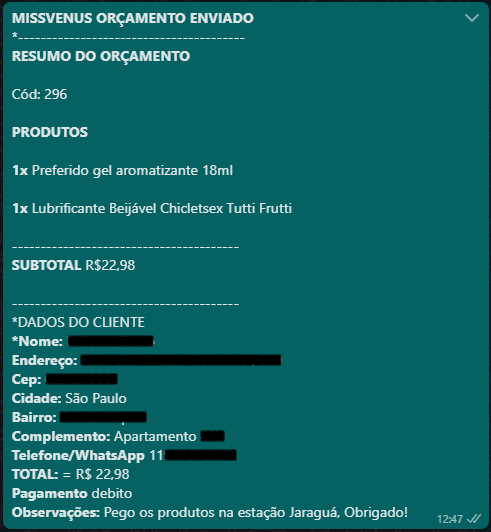

<h3>Envie dados da compra para o vendedor pelo whatsapp.</h3>

Abaixo um exemplo das informaçoes do produto e dados do cliênte enviadas pelo whatsapp. 
 Entre na pasta do plugin woocommerce e faça um backup do arquivo order-details.php e troque ele por este que está no repositório.

 

<h2>No wp-config adicione um define com o numero da loja ex: define('WHATSAPP','5511900000000');<h2/>
